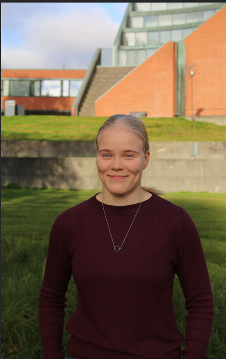

This page consists of works that I have done in different contents, my Bachelor's thesis and resume are  here as well. At about page there is little more contexs for each work.

Please have a look and feel free to email me in case of any questions!

::: {.card .border-primary .shadow-sm}
::: {.card-header .bg-primary .text-white .fw-bold}
About Me
:::

::: {.card-body}

:::: {.columns}

::: {.column width="60%"}
Hi! I'm Emma Kuutti,a biomedical engineering master student from Aalto University, Finland.

Please, feel free to be in touch!

* **LinkedIn:** [Emma Kuutti](https://www.linkedin.com/in/emma-kuutti)
* **GitHub:** [emmakuutti](https://github.com/emmakuutti)
* **Email:** [emma.kuutti@gmail.com](mailto:emma.kuutti@gmail.com)
:::

::: {.column width="40%"}
{.rounded width="100%"}
:::

::::
:::
:::